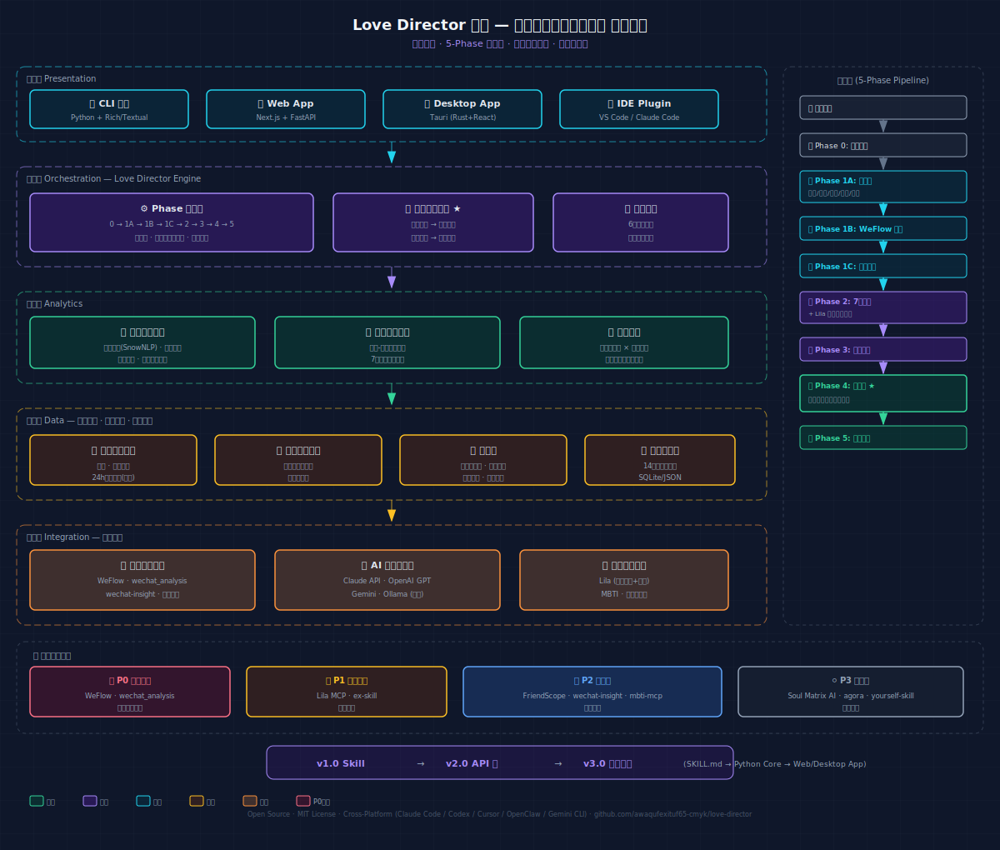

# 恋爱观测导演系统 Love Director .skill

> "世界是畸形且残酷的，但是我希望追求真爱的人都能获得真正的幸福。"
>
> 我并不指望该项目能为你提供完全的恋爱指引，但是我希望它能给你提供由各种媒体调研总结出来的一些数据和分析，你能决定自己幸福的道路该怎么走。
>
> 感谢你的阅读。
>
> — EnV

---

## 这是什么？



Love Director 是一个**恋爱观观测与导演系统**。关于目前的中国恋爱大环境为主的工具

不是恋爱顾问（不教你"怎么追人"），不是反诈工具（那个在 [emotional-fraud-detector](https://github.com/awaqufexituf65-cmyk/emotional-fraud-detector)），不是心理治疗师（不诊断不治疗）。

Love Director 是**导演**——它基于你的真实聊天数据和全国婚恋统计数据，为你演绎你的爱情可能的多种走向。不是告诉你"应该怎么做"，而是让你**看见**不同的选择会通向哪里。

---

## 核心功能

-  **三层用户画像**: 自述问卷 + WeFlow 微信聊天行为提取 + 差距分析
-  **七维恋爱哲学探针**: 时间信念/关系目的/价值排序/付出观念/冲突信念/社交媒体渗透/安全感来源
-  **行为观测**: 结合 wechat_analysis 情感分析曲线 + 跨关系模式对比
-  **概率化决策树**: 从你的数据中生长出多种爱情走向，每条带达成概率和数据依据
-  **导演视角**: 六种结局类型（惯性/成长/意外/警示/循环/重构）的故事演绎

---

## 安装

### 一键安装（推荐）

```bash
npx skills add awaqufexituf65-cmyk/love-director
```

### 手动安装

#### Claude Code

```bash
git clone https://github.com/awaqufexituf65-cmyk/love-director.git \
  ~/.claude/skills/love-director
```

### Codex CLI

```bash
git clone https://github.com/awaqufexituf65-cmyk/love-director.git \
  ~/.agents/skills/love-director
```

### 其他平台

Love Director 遵循 [agentskills.io](https://agentskills.io) 开放标准，兼容 Cursor、Gemini CLI、GitHub Copilot CLI 等支持该标准的平台。

---

## 使用方式

在 Claude Code（或其他支持的 AI agent）中说：

> "帮我分析一下我自己的恋爱模式"

Skill 会自动触发，按 5 阶段流程引导你。

---

## 工作流

```
Phase 0: 安全声明 + 导演定位
Phase 1: 用户画像（自述 + WeFlow多对象导出 + 差距）
Phase 2: 恋爱哲学探针（7维度 + 依恋风格）
Phase 3: 行为观测（数据对照 + 核心模式提取）
Phase 4: 🎬 决策树演绎（概率化多走向剧本）
Phase 5: 🎥 导演视角（你的选择）
```

---

## 外部工具联动

Love Director 可以与以下开源项目联动，增强分析深度：

| 优先级 | 项目 | 用途 |
|--------|------|------|
| 🔴 P0 | [WeFlow](https://github.com/hicccc77/WeFlow) | 微信聊天记录导出 |
| 🔴 P0 | [wechat_analysis](https://github.com/4everzyj/wechat_analysis) | 情感评分曲线 + 情绪热力图 |
| 🟠 P1 | [Lila MCP](https://github.com/lila-graph/lila-mcp) | 依恋风格评估 + 大五人格 |
| 🟠 P1 | [ex-skill](https://github.com/perkfly/ex-skill) | 对方人格蒸馏 |
| 🟡 P2 | [FriendScope](https://github.com/ChanMeng666/friendscope) | 关系10维度评估框架 |
| 🟡 P2 | [wechat-insight](https://github.com/caigee-cmd/wechat-insight) | MBTI推断 + 社交网络 |

详见 [docs/architecture.md](docs/architecture.md)

---

## 数据来源

Love Director 的知识库汇编了超过 14 个权威来源的中国婚恋数据：

- 中国科学院心理研究所 (55,781 人样本)
- 北京师范大学 × 小红书联合报告
- 抖音《2024 婚恋观白皮书》
- 复旦大学《中国青年网民社会心态调查报告》
- 珍爱网 × 民政职业大学白皮书
- Soul × 复旦大学社交趋势报告
- 中国青少年研究中心
- 严文华团队《中国年轻人爱情和婚姻的质性研究》
- .......

---

## 软件化演进

当前 v1.0 以 SKILL.md 形式运行。架构预留了完整软件化路径：

- `skill/` — 当前可用
- `engine/` — Python 核心引擎（待开发）
- `data/` — 结构化知识库
- `docs/architecture.md` — 完整架构文档

---

## 姊妹项目

- [emotional-fraud-detector](https://github.com/awaqufexituf65-cmyk/emotional-fraud-detector) — 情感反诈分析

---

## 许可

MIT License

---

## 作者

**EnV** — awaqufexituf65@gmail.com

---

*Love Director 不能告诉你幸福的方向，但它可以让你看见选择。*
*你是你自己的导演。*
